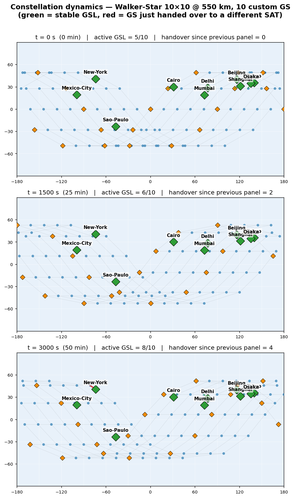

# spacesim — LLM-on-Satellite Simulator

[](#license) [](extensions/spacesim/README.md) [](ns3-sat-sim/) [](https://github.com/snkas/hypatia)

A **packet-level simulator for LLM request workloads served from compute-equipped LEO satellite constellations**. Built as a layered extension on top of [Hypatia](https://github.com/snkas/hypatia) (Kassing et al., IMC 2020); adds a Streamlit dashboard, a real-Azure-trace traffic generator, an ns-3 `llm-workload` C++ module (request / gather / compute / response, end-to-end TCP), and a per-request lifecycle analyzer.

> 中文文档入口：[`extensions/spacesim/功能说明.md`](extensions/spacesim/功能说明.md)
> Function-level deep dives: [`extensions/spacesim/docs/TECHNICAL_REPORT.md`](extensions/spacesim/docs/TECHNICAL_REPORT.md) / [`extensions/spacesim/docs/系统概览.md`](extensions/spacesim/docs/系统概览.md)

---

## Why this exists

LLM serving infrastructure is moving toward the edge. LEO constellations like Starlink offer the right latency profile (~20 ms RTT for a single hop) and global reach for **inference at the satellite**, not just at terrestrial data centers. But the design questions are open:

- How many of the constellation's satellites should carry GPUs?
- Where should they sit in the orbital planes?
- How does diurnal request demand interact with satellite handovers?
- Where does the bottleneck land — link bandwidth, ISL queueing, or inference time?

This simulator lets you answer those questions with **packet-level fidelity**: every byte goes through the TCP stack, every ISL queue has bandwidth and depth, every satellite handover triggers a route change.

---

## What's modelled

```
                ┌─────────────────────────────────────────────────────┐
                │  Ground stations (configurable: top-N cities or     │
                │  any custom lat/lon list)                            │
                └──────────────┬──────────────────────┬───────────────┘
                               │                       │
                          TCP  │ LLMHeader (24B)       │  Response stream
                          │    │ + L_in tokens         │  (L_out × bytes_per_token)
                          │    │                       │
                          ▼    ▼                       ▲
        ┌────────────────────────────────────────────────────────────┐
        │  LEO constellation — Walker-Star, +Grid ISLs, time-varying │
        │                                                             │
        │   Transit SAT  ──ISL──  Compute SAT  ──ISL──  Transit SAT  │
        │       │             ▲       │                      │       │
        │       │             │       │ FIFO queue           │       │
        │   GSL │             │       │ T_compute =          │       │
        │  (handovers every   │       │ α·L_in+β·L_out+γ     │       │
        │   ~5 min @ 550 km)  │       ▼                      │       │
        │                     │   GatherApp →                │       │
        │                     │   ComputeApp →               │       │
        │                     │   Response (same socket)     │       │
        └─────────────────────┴──────────────────────────────────────┘
                                       │
                                       ▼ logs per stage
                       ┌──────────────────────────────┐
                       │  T_uplink + D_gather +       │
                       │  T_queue + T_compute +       │
                       │  T_return = T_total          │
                       └──────────────────────────────┘
```

Two workload modes:
- **Synthetic** — Poisson arrivals + Normal L_in (good for parameter sweeps)
- **Trace replay** — schedules every request from a real Azure LLM Inference Trace, per ground station, with hour-of-day shape (good for studying realistic diurnal load)

---

## Architecture

```
┌──────────────────────────────────────────────────────────────────────┐
│                       extensions/spacesim/                            │
│      (the Python package + the C++ ns-3 module + the Streamlit UI)   │
│                                                                       │
│   config   topology   workload   runner   analysis   viz             │
│      └──────┬───────────┬──────────┬─────────┬──────────┬────┐       │
│             │           │          │         │          │    │       │
│             ▼           ▼          ▼         ▼          ▼    ▼       │
│         dataclass   satgenpy   ns-3 C++   waf      per-req    Plotly │
│         + JSON      → cached  llm-workload subprocess DataFrame  3D  │
│         + hash      topology   module                          globe │
│             │                                                        │
│             │                            ┌─────────────────────┐    │
│             └─►  dashboard/app.py  ◄────┤  scenarios/*/run.sh  │    │
│                  (Streamlit UI)          │  (scripted CLI)      │    │
│                                          └─────────────────────┘    │
└──────────────────────┬───────────────────────────────────────────────┘
                       │  Reads from / writes to
                       ▼
┌──────────────────────────────────────────────────────────────────────┐
│                    extensions/traffic_generator/                      │
│                                                                       │
│   Azure trace CSV  →  AzureTraceFitter (d[τ] + L_in/L_out buckets)   │
│                    →  NHPP thinning (per-GS rate · local time)       │
│                    →  per-GS events_gs<N>_<city>.csv                 │
└──────────────────────────────────────────────────────────────────────┘

┌──────────────────────────────────────────────────────────────────────┐
│                          Upstream Hypatia                             │
│                                                                       │
│   satgenpy/        — TLE / ISL / dynamic forwarding state generator  │
│   ns3-sat-sim/     — ns-3 with satellite + basic-sim modules         │
│   paper/           — original IMC 2020 paper scripts + data           │
│   satviz/          — Cesium-based visualization (not used here)       │
└──────────────────────────────────────────────────────────────────────┘
```

Single LLM request, end-to-end:

```
1.  GS opens TCP socket to compute SAT (route from fstate_<t>.txt)
2.  GS sends 24-byte LLMHeader (t_emit, req_id, src, L_in)
3.  GS sends L_in × bytes_per_token bytes of prompt payload
4.  GS half-closes (ShutdownSend) ─────────────────────────────┐
5.  SAT GatherApp drains the header + payload                  │
6.  SAT ComputeApp enqueues request                            │ — measurable
7.  FIFO queue (multi-tenant)                                  │   per-stage
8.  T_compute = α·L_in + β·L_out + γ  (ns)                     │   delays
9.  SAT writes L_out × bytes_per_token response bytes back     │
10. SAT half-closes, GS sees FIN                               │
11. Both ends log to CSV ──────────────────────────────────────┘
12. analysis/lifecycle.py joins 3 CSVs → per-request DataFrame
```

See [`extensions/spacesim/README.md`](extensions/spacesim/README.md) for full per-layer documentation; [`extensions/spacesim/docs/TECHNICAL_REPORT.md`](extensions/spacesim/docs/TECHNICAL_REPORT.md) for function-by-function details.

---

## Quick start

Prereqs: Ubuntu 20.04+, Python 3.8+, build-essential, the existing Hypatia ns-3 build (one-time `./build.sh` in `ns3-sat-sim/`).

```bash
# 1) Clone (or just pull if you already have it)
git clone git@github.com:Markliu225/spacesim.git
cd spacesim

# 2) Install Python deps
python -m venv ~/spacesim/venv && source ~/spacesim/venv/bin/activate
pip install -r extensions/spacesim/requirements.txt

# 3) Build the ns-3 llm-workload module (one-time, ~5 min)
cd extensions/spacesim/workload && bash install_ns3_module.sh

# 4) Optional: generate a real-Azure event trace once (24h × 10 cities)
cd ../../../traffic_generator
python traffic_gen.py \
    --azure-trace azure_trace/AzureLMMInferenceTrace_multimodal.csv \
    --gs-config ground_stations.json \
    --duration-sec 86400 \
    --output-dir real_run --report

# 5) Launch the dashboard
cd ../spacesim && ./start.sh    # → http://localhost:8501
```

Once the dashboard is open: drag sliders in the sidebar, click **Run Simulation**, watch the live log, then check the **Results** tab.

The **3D Globe** tab has a time slider — drag it and watch satellites orbit, GSLs handover, the Earth rotate underneath.

---

## Features added on top of Hypatia

| Feature | Where it lives | Why it matters |
|---|---|---|
| Real Azure trace replay | [`extensions/traffic_generator/`](extensions/traffic_generator/), [`extensions/spacesim/workload/events_replay.py`](extensions/spacesim/workload/events_replay.py) | Diurnal request shape from real data, not synthetic Poisson |
| Custom ground-station JSON | [`extensions/spacesim/config/schema.py`](extensions/spacesim/config/schema.py) (`gs_config_path`), [`extensions/spacesim/topology/build.py`](extensions/spacesim/topology/build.py) | One JSON drives both trace generation and topology — gs_idx alignment by construction |
| ns-3 `llm-workload` module (TCP) | [`extensions/spacesim/workload/ns3_module/`](extensions/spacesim/workload/ns3_module/) | Request + Gather + Compute + Response, full TCP. Header in-band, response on same socket |
| Long simulations (1h–2h) | duration slider 60s → 7200s + fstate file-count guard | Diurnal handover studies feasible with smart `update_interval_ms` |
| Dynamic 3D globe | [`extensions/spacesim/dashboard/app.py`](extensions/spacesim/dashboard/app.py) `_build_preview_globe` | Time slider triggers Kepler propagation + Earth rotation + GSL handover preview |
| Cache partial-hit | [`extensions/spacesim/topology/build.py`](extensions/spacesim/topology/build.py) | Changing `(duration, interval)` only regenerates fstate, not TLEs/ISLs |
| Streamlit dashboard | [`extensions/spacesim/dashboard/app.py`](extensions/spacesim/dashboard/app.py) | Interactive config + globe + results without writing scenario scripts |
| Per-request lifecycle analyzer | [`extensions/spacesim/analysis/lifecycle.py`](extensions/spacesim/analysis/lifecycle.py) | Joins 3 CSV families into a single DataFrame with per-stage delays |

---

## Visual proof: dynamic constellation

Generated by the dashboard's globe preview, with custom 10-city `ground_stations.json` and Walker-Star 10×10 @ 550 km:



Top row: t = 0s, 1500s, 3000s. **Red lines** = GSLs that just handed over to a different satellite since the previous panel; **green lines** = stable GSLs.

Quantified across 50 simulated minutes, 10 ground stations, 30-second sampling:
- **92 total GSL handovers**
- Mean dwell time per (GS, sat) pair ≈ **326 s** ≈ 5.4 min
  — matches the physical visibility window for a Starlink-class LEO satellite from a fixed point on the ground

Full evidence (6 single-frame PNGs + composite chart) in [`extensions/spacesim/docs/dynamic_proof/`](extensions/spacesim/docs/dynamic_proof/).

---

## Repository layout

```
spacesim/
├── README.md                    ← you are here (project root)
│
├── extensions/                  ← everything spacesim added
│   ├── spacesim/
│   │   ├── README.md             — extension-level guide (English)
│   │   ├── 功能说明.md             — extension-level guide (Chinese)
│   │   ├── config/               — Shell / Workload / Compute / Simulation dataclasses
│   │   ├── topology/             — Walker-Star generator + role + augment + custom GS
│   │   ├── workload/             — schedule writers (synthetic, trace replay) + C++ module
│   │   ├── runner/               — threaded waf-subprocess wrapper
│   │   ├── analysis/             — per-request lifecycle reconstruction
│   │   ├── viz/                  — Plotly globe / CDF / breakdown
│   │   ├── dashboard/            — Streamlit app
│   │   ├── scenarios/            — scripted experiments + regression fixtures
│   │   ├── tests/                — pytest suite
│   │   └── docs/                 — TECHNICAL_REPORT.md, 系统概览.md, dynamic_proof/
│   │
│   └── traffic_generator/        — Azure trace → per-GS events CSVs
│
├── satgenpy/                    ← upstream Hypatia
├── ns3-sat-sim/                  — ns-3 + satellite-network + basic-sim modules
├── paper/                        — original Hypatia paper data + scripts
└── satviz/                       — Cesium visualization (unused in spacesim)
```

---

## Documentation index

| For | Read |
|---|---|
| Project pitch, architecture, getting started | this README |
| Layer-by-layer guide to spacesim | [`extensions/spacesim/README.md`](extensions/spacesim/README.md) / [`功能说明.md`](extensions/spacesim/功能说明.md) |
| Every public function + every CSV column | [`extensions/spacesim/docs/TECHNICAL_REPORT.md`](extensions/spacesim/docs/TECHNICAL_REPORT.md) (EN) / [`docs/系统概览.md`](extensions/spacesim/docs/系统概览.md) (CN) |
| Proof that the constellation is dynamic | [`extensions/spacesim/docs/dynamic_proof/`](extensions/spacesim/docs/dynamic_proof/) |
| Past per-phase work logs | [`extensions/spacesim/docs/history/`](extensions/spacesim/docs/history/) |

---

## Acknowledgements

Built on top of **[Hypatia](https://github.com/snkas/hypatia)** by Simon Kassing, Debopam Bhattacherjee, André Baptista Águas, Jens Eirik Saethre, and Ankit Singla (ETH Zürich), published as *"Exploring the 'Internet from Space' with Hypatia"* at IMC 2020. The `satgenpy`, `ns3-sat-sim`, `paper`, and `satviz` directories are upstream-as-is; everything under `extensions/` is the spacesim contribution.

The **Azure LLM Inference Trace** (multimodal, 1 week, 1M rows) is from the [AzurePublicDataset](https://github.com/Azure/AzurePublicDataset) repository.

---

## License

- Upstream Hypatia: each subdirectory carries its own license (`satgenpy` MIT, `ns3-sat-sim` GPL-2.0, etc.) — see those subdirs.
- spacesim contribution (everything under `extensions/`): MIT.
