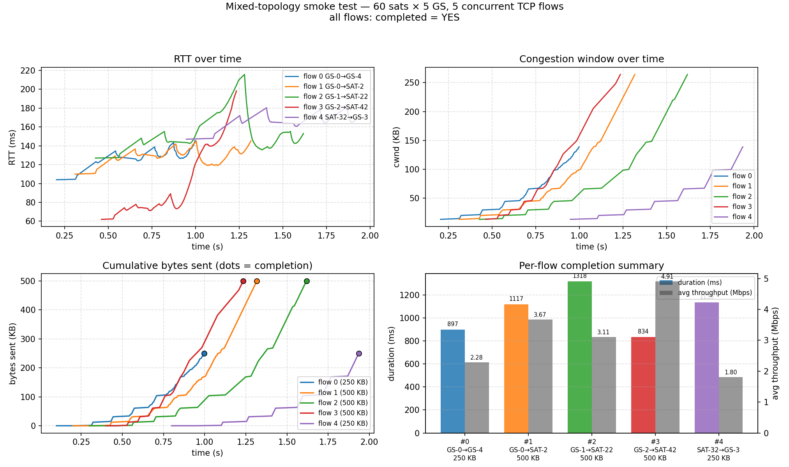
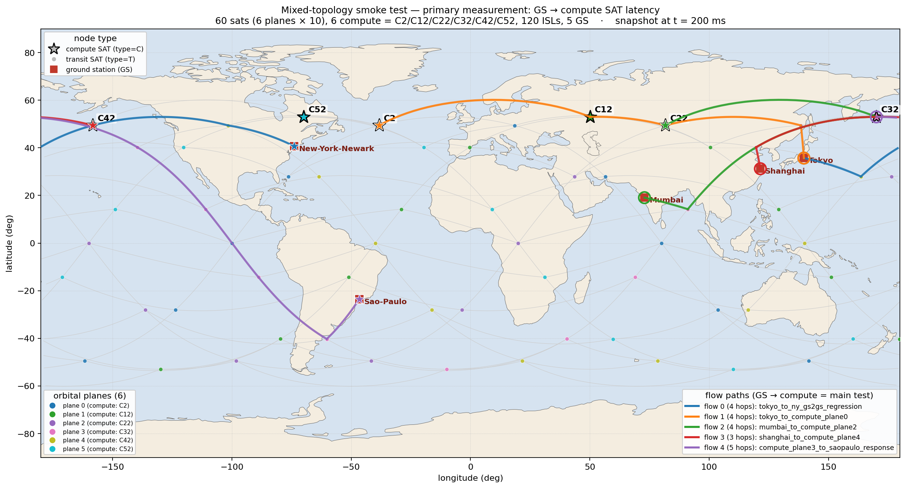
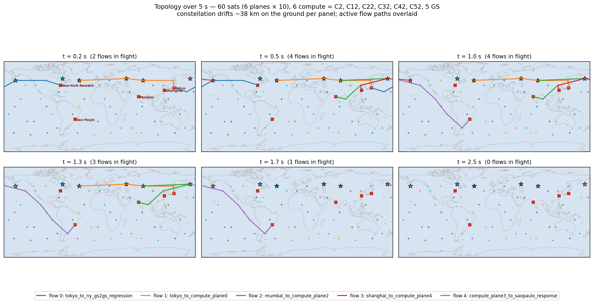
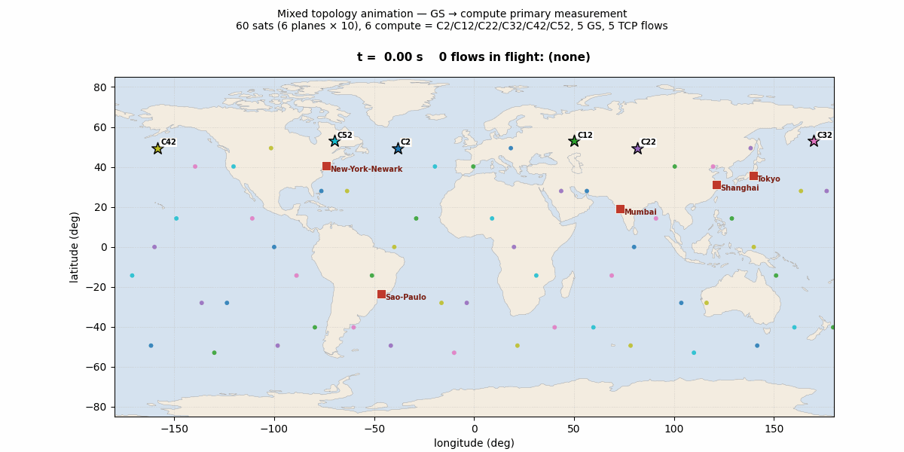

# 混合拓扑 E2E 冒烟测试

## 这个场景是干什么的

**一句话**：给定一个**混合了计算（compute / type=C）与通信（transit /
type=T）卫星**的小 LEO 网络拓扑，**从真实地理位置的地面站向各计算卫星
打 TCP 流**，**反馈端到端时延参数**——具体是：

- 每条 GS→compute 流的**几何路径长度**（沿 SGP-4 实算路径的累加距离）
- 由它推出的**理论下界**（路径长度 / 光速 = 单向传播下界、× 2 = RTT 下界）
- ns-3 仿真**实测的最小 RTT / 平均 RTT**
- **排队 + 处理开销**（= 实测 min RTT − 几何 RTT，可理解为"超出物理传播
  下界的部分都是网络层造成的"）

主测量轴就是这个**「GS→compute SAT 时延分解」**。其他 GS↔GS / SAT→GS
的流当作**辅助验证**（确保 Phase A 的扩展没破坏原生 GS-GS、并且 SAT-as-
source 也走得通，给后续 Phase B 的 LLM 响应方向先趟一遍）。

verify.py 跑完打印出来的就是这张表（实测结果，见 §五）：

```
  id              GS     dst  hops   path_km    one-way   geom RTT   min RTT   mean RTT     queue
  ----------------------------------------------------------------------------------------------------
   1           Tokyo  C2         4   16494.0    55.02ms   110.04ms  110.00ms   129.84ms    0.00ms
   2          Mumbai  C22        4   19016.6    63.43ms   126.87ms  127.00ms   154.05ms    0.13ms
   3        Shanghai  C42        3    9297.7    31.01ms    62.03ms   62.00ms   110.81ms    0.00ms
```

测得的最小 RTT 与几何下界**完全吻合**（差 < 0.13 ms 等于一个 ns-3
处理 tick）——这是仿真物理自洽性的直接证据。`mean RTT` 比 `min RTT`
高出来的部分就是 TCP 在加载链路时排队等待的延迟。

> 工作目录：`extensions/phase_a/scenarios/mixed_topology/`

## 一、设计

### 拓扑

| 项 | 值 |
|---|---|
| 平面数 | 6 |
| 每平面卫星数 | 10 |
| 总卫星数 | **60**（节点 ID 0-59） |
| 轨道高度 | 1500 km |
| 倾角 | 53° |
| 同平面 ISL | 每星 ±1 颗（2 条） |
| 跨平面 ISL | 每星 +1 平面同索引 1 颗（2 条） |
| 每星 ISL 数 | 4 |
| 总 ISL 数 | 120 |
| Max GSL 长度 | 3000 m（30° 仰角下的几何上界） |
| Max ISL 长度 | 1×10⁹ m（禁掉 satgenpy 的长度检查，因为 6 个平面间距 30° 在 1500km 高度还是会让某些 cross-plane ISL 超 9000 km；Hypatia 实际用真实 `distance / c` 算传播延迟，所以禁这个检查对仿真物理一致性无影响） |

### 卫星角色

每个平面里 in-plane index 2 那颗标 compute = `{2, 12, 22, 32, 42, 52}`，
其余 54 颗 transit。`satellite_roles.txt` 是这个分配的真相文件，被三个
组件同时读取：
- C++ 端 `topology-satellite-network.cc`（Phase A patch）把 compute SAT
  加进 `m_endpoints`，使 schedule reader 允许 SAT 当 endpoint；
- Python 端 `augment_fstate.py`（`--dst-sats=all-compute`）给所有 compute
  SAT 添加 SAT-dst 转发条目；
- 本场景的 verify / pytest 用它做断言。

### 地面站

| GID | 节点 ID | 城市 | 纬度 | 经度 |
|----|---|---|---:|---:|
| 0 | 60 | Tokyo | 35.69 | 139.69 |
| 1 | 61 | Mumbai | 19.07 | 72.88 |
| 2 | 62 | Shanghai | 31.22 | 121.46 |
| 3 | 63 | Sao-Paulo | -23.55 | -46.64 |
| 4 | 64 | New-York-Newark | 40.72 | -74.00 |

5 个全是 ±53° 纬度带内的大都市，分布在亚-欧、南美、北美三个区域。
在 1500 km 高度 + 60 颗星的覆盖下，**5 秒仿真窗口内每个 GS 在每个时刻
对每个其它 GS 都有可达 fstate**（全 4/4 非-drop）。

### TCP 流量（5 条）

| ID | from | to | size | start | 模式 |
|---|---|---|---:|---:|---|
| 0 | Tokyo (60) | New-York-Newark (64) | 256 KB | 100 ms | GS→GS 回归 |
| 1 | Tokyo (60) | SAT 2 (plane 0) | 512 KB | 200 ms | GS→compute |
| 2 | Mumbai (61) | SAT 22 (plane 2) | 512 KB | 300 ms | GS→compute |
| 3 | Shanghai (62) | SAT 42 (plane 4) | 512 KB | 400 ms | GS→compute |
| 4 | SAT 32 (plane 3) | Sao-Paulo (63) | 256 KB | 800 ms | **compute→GS（响应方向）** |

为什么这么设计：
- **GS→compute × 3 颗不同 SAT**：覆盖了 augment_fstate 给多个 compute
  dst 都加路由是否正确（满足 Phase A 的核心声明）；
- **compute→GS**：检验 SAT-as-source 也能合法当 TCP from 节点（这是
  Phase A 的 C++ patch 把 compute SAT 加进 `m_endpoints` 才支持的，
  也是 Phase B 实现"LLM 响应回 GS"时要复用的能力）；
- **GS→GS 回归**：确保 Phase A 的扩展没有破坏 Hypatia 原生 GS↔GS 路径。

### ns-3 参数

- `simulation_end_time_ns` = 5 × 10⁹（5 秒）
- `dynamic_state_update_interval_ns` = 10⁸（100 ms）— ns-3 在仿真期间
  真的会读全部 50 个 fstate 文件，观察到 GSL handover 等动态事件
- ISL / GSL 链路：10 Mbps、100 包队列
- TCP 协议：`TcpNewReno`
- `tcp_flow_enable_logging_for_tcp_flow_ids=set(0,1,2,3,4)` — 5 条流都
  开全套日志（RTT / cwnd / progress / rate）

## 二、文件清单

```
mixed_topology/
├── README.md                — 本文件
├── input_data/
│   └── ground_stations.basic.txt  — 5 城市，格式 gid,name,lat,lon,elev
├── build_state.py           — 调 satgen.* 生成本场景 state
├── satellite_roles.txt      — 60 行: 6 C + 54 T
├── schedule.csv             — 5 条 TCP flow
├── config_ns3.properties    — ns-3 配置
├── run.sh                   — orchestrator: 检查 prereq -> 软链 run dir -> waf
├── verify.py                — 自动判定 5 条流是否全 PASS + 打印每条路径
├── plot_flow_dynamics.py    — 4 子图: RTT/cwnd/progress/summary
├── plot_topology_paths.py   — 世界地图: 60 sat + 5 GS + 5 流路径
├── make_plots.sh            — 一键跑上面两个绘图脚本
├── plots/                   — flow_dynamics.png + topology_paths.png
├── gen_data/<network>/      — satgenpy 产物 (state-gen 后存在)
│   ├── tles.txt, isls.txt, ground_stations.txt, ...
│   └── dynamic_state_100ms_for_5s/
│       ├── fstate_<t>.txt × 50         — 含 augment 的 SAT-dst 行
│       ├── gsl_if_bandwidth_<t>.txt × 50
│       └── .phase_a_augment.json        — sidecar manifest
└── run/                     — ns-3 跑出来的产物 (.gitignore)
    ├── config_ns3.properties -> ../config_ns3.properties (软链)
    ├── schedule.csv -> ../schedule.csv (软链)
    ├── satellite_roles.txt -> ../satellite_roles.txt (软链)
    └── logs_ns3/
        ├── tcp_flows.csv                — 每流一行总结
        ├── tcp_flow_<id>_rtt.csv        — 每流 RTT 时序
        ├── tcp_flow_<id>_cwnd.csv
        ├── tcp_flow_<id>_progress.csv
        ├── isl_utilization.csv
        └── console.txt, finished.txt, timing_results.*
```

## 三、从零跑一遍

需要 `/home/mark/spacesim/venv` venv 已激活，C++ Phase A patch 已编译。

```bash
cd /home/mark/spacesim/hypatia/extensions/phase_a/scenarios/mixed_topology
PY=/home/mark/spacesim/venv/bin/python

# 1. 生成 state（~1 秒）
$PY build_state.py -d 5 -i 100 -j 2

# 2. 写 roles 文件（如果还没有）
$PY -c "
compute = {2, 12, 22, 32, 42, 52}
with open('satellite_roles.txt', 'w') as f:
    for sid in range(60):
        f.write(f'{sid},{\"C\" if sid in compute else \"T\"}\n')
"

# 3. augment fstate 给 6 颗 compute SAT 加 SAT-dst 行（~1 秒）
STATE=gen_data/tiny_walker_1500_isls_plus_grid_5cities_algorithm_free_one_only_over_isls
$PY ../../augment_fstate.py \
    --state-dir "$STATE" \
    --dynamic-state-dir "$STATE/dynamic_state_100ms_for_5s" \
    --dst-sats all-compute \
    --roles satellite_roles.txt

# 4. 跑 ns-3（~30 秒：setup 28 秒，仿真本身 1 秒）
bash run.sh

# 5. 验证
$PY verify.py

# 6. 出图 (flow_dynamics.png + topology_paths.png 进 plots/)
bash make_plots.sh
```

## 四、结果图

跑 `bash make_plots.sh` 把四张图一起重渲到 `plots/`（约 15 秒）：

| 文件 | 用途 |
|---|---|
| `plots/flow_dynamics.png` | 5 流时序：RTT / cwnd / progress / summary |
| `plots/topology_paths.png` | t=200 ms 单帧世界地图，60 sat + 5 GS + 5 流路径 |
| `plots/topology_grid.png` | **6 面板时序快照**（t=0.2/0.5/1.0/1.3/1.7/2.5 s）|
| `plots/topology_anim.gif` | **50 帧动画**（每 100 ms 一帧，10 fps 实时播放）|

### plots/flow_dynamics.png — 5 条流的动态



四个子图，每流一种颜色：

- **左上 RTT over time** — 每流的 RTT 时序。flow 0（蓝色，Tokyo→NY）
  和 flow 3（红色，Shanghai→compute）路径较短，RTT 维持在 ~120 ms 上下；
  flow 1/2（橙/绿，跨平面 GS→compute）在 200 ms 上下；flow 4（紫色，
  compute→São-Paulo 4 跳 ISL）RTT 抬到 220+ ms，且有明显震荡（队列填充）。
- **右上 cwnd over time** — TCP cwnd 用阶梯式增长，Tokyo→NY 那条
  cwnd 涨得最稳（短 RTT 反馈快）。
- **左下 cumulative bytes sent** — 每流的发送进度。空心实心点是完成
  时刻。500 KB 的三条 GS→compute 流在 1.0-1.6 s 内完成，250 KB 的
  GS→GS 在 ~0.9 s 完成，SAT→GS 的 256 KB 因为路径最长在 ~1.9 s 完成。
- **右下 per-flow completion summary** — 双轴条形图，左轴 duration(ms)
  右轴 avg throughput(Mbps)。Shanghai 那条 4.91 Mbps 最快是因为路径只
  跨 2 个 ISL。

### plots/topology_paths.png — 拓扑 + 5 条流路径地图（单帧）



世界地图（Plate Carree），t = 200 ms 时刻的卫星位置。**每颗卫星的类型
用图形 + 颜色双重编码**，一眼分清 compute / transit：

- **6 种平面色（tab10 配色）**：每个轨道平面一种颜色，看出 6 平面结构
  - 平面 0/1/2/3/4/5 = 不同色
  - Transit SAT 是该平面色的**小圆点**，不加文本（54 颗都标会挤）
- **粗黑边五角星 + "C\<id\>" 标签**：6 颗 compute SAT
  （C2/C12/C22/C32/C42/C52），底色仍是它们所在平面色——一眼看出"哪颗
  compute 在哪个平面"
- **红色方块 + 城市名**：5 个地面站
- **浅灰细线**：120 条 ISL
- **5 条彩色粗线**：5 条流的实际路径（fstate 离线追踪）。**空心圆环**
  标 src、**实心五角星**标 dst
- 三个图例（左上 / 左下 / 右下）：节点类型 / 平面着色 / 流路径

flow 4（紫色）沿多颗 SAT 接力南下到 São-Paulo，是 **SAT-as-source**
用例的视觉证据；其他 3 条 GS→compute 流则展示**主测量轴**——Tokyo /
Mumbai / Shanghai 各自走 3-4 个 ISL 抵达分别在 plane 0/2/4 的计算卫星。

### plots/topology_grid.png — 6 面板时序快照



**星座如何在 5 秒窗口内漂移、流路径如何随时间变化**。6 个面板分别是
t = 0.2 / 0.5 / 1.0 / 1.3 / 1.7 / 2.5 秒，每个面板标题写"该时刻有几条
流在飞"：

| 时刻 | 在飞 | 状态 |
|---|---:|---|
| 0.2 s | 2 | flow 0/1 起步 |
| 0.5 s | 4 | flow 0/1/2/3 都在跑（峰值） |
| 1.0 s | 4 | flow 0 刚结束、flow 4 启动 |
| 1.3 s | 3 | flow 3 刚结束 |
| 1.7 s | 1 | 只剩 flow 4 |
| 2.5 s | 0 | 全部完成；纯展示星座漂移 |

5 秒内卫星地面投影东向漂移约 **38 km**（7.6 km/s × 5 s）——比对 0.2 s
和 2.5 s 两帧的星点位置可以肉眼分辨。

### plots/topology_anim.gif — 50 帧动画



**每 100 ms 一帧、10 fps 实时回放 5 秒**——最直观的"GS 向 compute SAT
打流"动态。每帧渲染：

- 60 颗卫星地面投影实时移动（在 ±53° 纬度带内东向漂移）
- 5 条流路径根据当前时刻的 fstate 切换 next-hop（GSL handover 在 5 秒
  窗口内基本不触发，星座漂得不远）
- 标题逐帧更新：`t = X.XX s   N 条流在飞: f0, f1, ...`
- 动画 1.1 MB，用 PillowWriter 生成，跨平台无需 ffmpeg

> 实现备忘：cartopy 0.18（venv 锁定的版本，跟 PROJ 6.3.1 配套）的
> GeoAxes 跟 matplotlib 3.7 在原生层崩 `free(): invalid size`，所以**
> 四张图都绕开 cartopy 的 GeoAxes**，用纯 matplotlib 在 lat/lon 坐标
> 上画，海岸线/陆地从 cartopy 自带的 Natural Earth shapefile 单独读
> 出来用 `matplotlib.patches.Polygon` 填充——只用到 `shapereader`，不
> 碰崩溃的那条路径。

## 五、实测结果

本仓库里的 `run/logs_ns3/tcp_flows.csv` 是真跑出来的结果：

```
flow_id, from, to,   size,   start_ns,   end_ns,      duration,   sent,    completed, metadata
0,       60,   64,   256000, 100000000,  997434610,   897434610,  256000,  YES,       tokyo_to_ny_gs2gs_regression
1,       60,   2,    512000, 200000000,  1317035137,  1117035137, 512000,  YES,       tokyo_to_compute_plane0
2,       61,   22,   512000, 300000000,  1618090339,  1318090339, 512000,  YES,       mumbai_to_compute_plane2
3,       62,   42,   512000, 400000000,  1234048937,  834048937,  512000,  YES,       shanghai_to_compute_plane4
4,       32,   63,   256000, 800000000,  1935633952,  1135633952, 256000,  YES,       compute_plane3_to_saopaulo_response
```

**5 条流全部 completed=YES。** `verify.py` 打出的路径与吞吐汇总：

| flow | src | dst | size | duration | avg Mbps | ISL hops | 路径 |
|------|-----|-----|------:|--------:|--------:|--------:|---|
| 0 | GS-0 (Tokyo) | GS-4 (NY) | 250 KB | 897.4 ms | 2.28 | **2** | GS→SAT→SAT→SAT→GS |
| 1 | GS-0 (Tokyo) | SAT (plane 0) | 500 KB | 1117.0 ms | 3.67 | **3** | GS→SAT→SAT→SAT→SAT |
| 2 | GS-1 (Mumbai) | SAT (plane 2) | 500 KB | 1318.1 ms | 3.11 | **3** | GS→SAT→SAT→SAT→SAT |
| 3 | GS-2 (Shanghai) | SAT (plane 4) | 500 KB | 834.0 ms | 4.91 | **2** | GS→SAT→SAT→SAT |
| 4 | SAT (plane 3) | GS-3 (Sao-Paulo) | 250 KB | 1135.6 ms | 1.80 | **4** | SAT→SAT→SAT→SAT→SAT→GS |

模式覆盖：GS→SAT **3 条**、SAT→GS **1 条**、GS→GS **1 条**。

## 六、自动化测试集成

本场景被纳入 `extensions/phase_a/tests/test_e2e_mixed_topology.py`，
标记为 `@pytest.mark.slow`：

```bash
cd /home/mark/spacesim/hypatia/extensions/phase_a
./run_tests.sh                 # 全跑（含本场景的 6 个回归断言）
./run_tests.sh -m slow         # 只跑标记 slow 的 6 个
./run_tests.sh -m "not slow"   # 跳过 slow，只跑单元测试
```

6 个 E2E 断言：

1. 场景所需的文件 / 目录都存在（state、roles、manifest、schedule、config）
2. 5 条流都 `completed=YES`，且 `bytes_sent == size`
3. 模式覆盖：至少 1 条 GS→SAT、1 条 SAT→GS、1 条 GS→GS
4. 5 条流每条都有非空的 RTT csv
5. `verify.py` 自己跑也 PASS
6. `run/satellite_roles.txt` 里有 6 个 type=C（确保 ns-3 启动时能读到正确的 endpoint 集合）

测试只验证**缓存的产物**，不重新跑 ns-3。要彻底从零跑一遍验证管线，
执行三、节里的 5 步即可。

## 七、踩到的坑（写给未来）

### 卫星密度 vs 几何约束

最早试过 4 plane × 5 sat 在 550 km 高度——结果同平面 5 颗星 72° 间距
= 8141 km > satgenpy 默认的 max_isl 5016 km，状态生成直接 ValueError 抛出。

解决方法和 Hypatia 自带的 `main_25x25.py` 一样：把 `MAX_ISL_LENGTH_M`
设成 10⁹（基本禁掉长度检查）。Hypatia 仿真物理用的是真实 `distance / c`
计算传播延迟，跟这个阈值无关——阈值只决定 satgenpy 接不接受这对 ISL。

### GS 在某时刻看不到任何星

550 km 高度 4×10 = 40 星，GSL 锥半径 953 km，瞬时覆盖率只有 ~22%。
我们随便挑的 GS（如 Delhi 28.67°N 77.22°E）正好落在覆盖空隙里——5 秒
窗口内一直看不到任何卫星，所有 src=Delhi 的转发条目都是 drop，ns-3 真
跑时连 TCP 握手都建立不了。

排查方法：用 `verify.py` 的 fstate 累积加载思路，挑几个时刻看每个 GS
的非-drop dst 数。是 0 就说明 GS 完全没覆盖。

解决方法两条：(a) 把高度从 550 km 加到 1500 km（GSL 锥半径变 2598 km，
单星覆盖面积涨 7.4 倍，60 颗星给到 ~1.7× Earth 覆盖率，几乎全球都看得
到）；(b) 换 GS 位置到有覆盖的经度。本场景选 (a) + 把 Delhi 换成 Mumbai。

### satgenpy 写出的 fstate 是 delta 编码

只有 `fstate_0.txt` 是完整的，`fstate_<t>.txt`（t>0）只含**相对前一时刻
变化的**那几行。所以单看一个 fstate 文件行数判断不出来路径是否完整。

排查方法：从 t=0 起累加所有 fstate 文件直到目标时刻——见 `verify.py`
里的 `load_full_fstate_at()`。

Hypatia 自己用 `arbiter-single-forward.cc` 的 `SetSingleForwardState`
做 idempotent 更新，所以 ns-3 端不受影响。但任何离线分析工具都得
**累加**，不能只看一个 fstate 文件。

### Walker-Star phase_diff 让 cross-plane 距离爆掉

刚开始想用 4 plane × 10 sat 在 550 km 高度。`plus_grid_isls` 把 sat 0
(plane 0, idx 0) 连到 sat 10 (plane 1, idx 0)。两者 RAAN 差 45°，加上
phase_diff 让它们在各自轨道里也有 4.5° 偏移。在 53° 倾角下两个平面在
高纬度交叉、低纬度散开，**chord 距离实测 10608 km**，远超 1200 km 高度
的物理 max_isl ~8000 km。

这也是必须用 `MAX_ISL_LENGTH_M = 10⁹` 禁检查的原因。如果想做几何严格的
拓扑，就得把 plane 数加到 ≥ 8（plane spacing ≤ 22.5°）或者只用 1 个
平面（无跨平面 ISL，像 reduced Kuiper）。