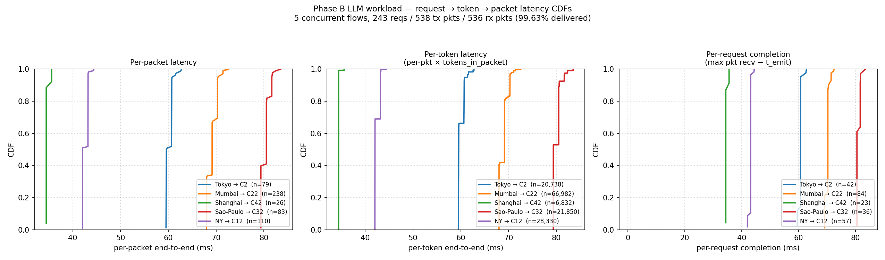
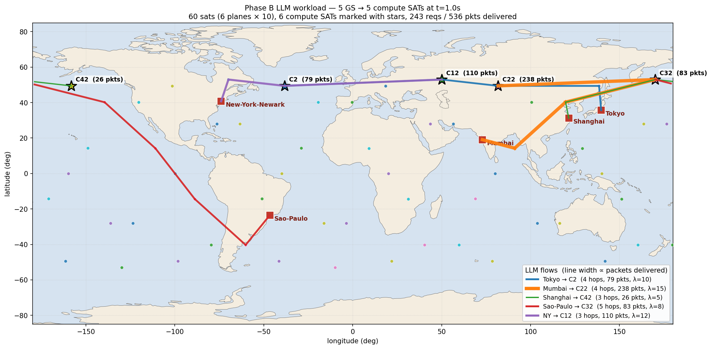
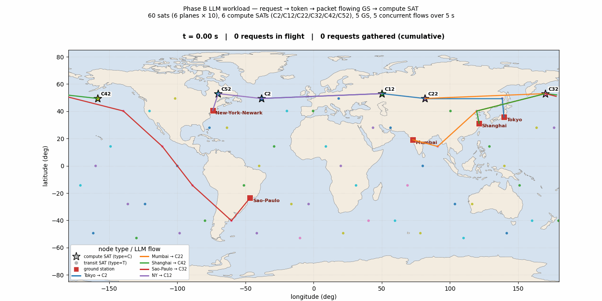
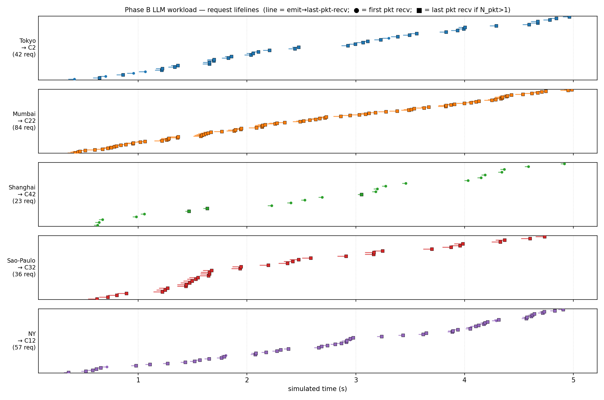

# 完整 LLM 推理流量场景：request → token → packet 到达 compute 卫星

Phase B 端到端测试场景。**给定一个混合 compute / transit 卫星的网络拓扑，
地面站产生 LLM 推理请求；request 切成 token、token 打成 packet，向计算
卫星打流，反馈三层时延：单 packet 到达 / 单 token 收齐 / 一个 request
所有 token 收齐。地理上把卫星类型标清楚，再配 50 帧实时动画展示时序。**

> 工作目录：`extensions/phase_b/scenarios/llm_workload/`

## 一、概念模型（request → token → packet）

LLM 推理请求由 GS 端的 `LLMRequestApplication` 按 **Poisson 到达**生成。
每个请求经过两次切分：

```
                ┌──────────────────────────────────┐
                │ 1 LLM inference request          │
                │   L_in tokens (从 N(μ,σ) 截断采样) │
                └──────────────────────────────────┘
                              │
                              │ 按 token 顺序切分
                              ▼
   ┌──────┬──────┬──────┬──────┬─── ... ───┬──────┐
   │ tok 0│ tok 1│ tok 2│ tok 3│           │tok L-1│      每 token = 4 字节
   └──────┴──────┴──────┴──────┴─── ... ───┴──────┘
                              │
                              │ packet_payload = 1400 B
                              │  ⇒ 1 packet 装 350 个 token
                              ▼
   ┌──────────────────┬──────────────────┬─── ... ───┬──────────────┐
   │ packet 0 (350 tok)│ packet 1 (350 tok)│           │packet N-1 (尾)│
   └──────────────────┴──────────────────┴─── ... ───┴──────────────┘
                              │
                              │ 每 packet 带 32 B LLMPacketTag:
                              │   req_id / packet_id / total_pkts /
                              │   t_emit_ns / src_node_id /
                              │   L_in / L_out_expected
                              ▼
                  UDP socket SendTo(compute_sat_ip, 9999)
                              │
                              │ Hypatia + ns-3:
                              │   GSL → ISL → ... → ISL → GSL
                              │   每跳 SGP-4 真实距离 / c 算传播延迟
                              ▼
                  compute SAT 的 LLMSinkApplication
                              │
                              ▼
                  per-packet CSV (一行一个 packet 到达事件)
```

`N_pkt = ⌈L_in × 4 / 1400⌉`。在我们配的 L_in ∈ N(300..800, σ) 区间内，
N_pkt 通常是 1–3，偶尔 4。

## 二、三层时延（核心反馈）

每个 packet 到达 compute SAT 的 CSV 行里都有 `recv_time_ns` 和
`t_emit_ns`。从这一份原始数据按 **三种聚合粒度**算时延：

| 层级 | 定义 | 含义 |
|---|---|---|
| **per-packet** | `recv_time_ns − t_emit_ns` （每包一个样本） | 单包端到端时延 |
| **per-token** | 同 per-packet 的值，但每包按它实际承载的 token 数复制成多个样本（`tokens_in_packet`） | 单 token 的到达时延，token-加权 CDF |
| **per-request** | `max(recv_time of packets in this request) − t_emit_ns`（每请求一个样本） | request 的最末一个 token 到齐的时延 ←—— LLM 应用真正感受到的时延 |

三层之间的关系：

```
per-packet  ≤  per-token  ≤  per-request
   (1 pkt)    (token-weighted)  (max over packets)
                                        △
                                        │
                                  gather wait
                                  = per-request − 首包 per-packet
                                  = (N_pkt - 1) × 1.14 ms
                                    (1400 B / 10 Mbps = 1.144 ms)
```

**为什么这三层都要给**：

- **per-packet**：网络栈最原始的指标；可以与 Phase A 几何下界直接比较，
  说明仿真物理自洽。
- **per-token**：当 L_in 在不同 request 间差异大时，**有更多 token 来自
  那些更大的 request**——per-token CDF 会因此偏向那些"大 request 拖慢的"
  部分。这是 LLM 应用层 SLO 的真实指标。
- **per-request**：决定 compute SAT 何时能真正开始 prefill 计算的时延。
  Phase C 的 gather barrier 触发点就是这个时刻。

## 三、网络拓扑（与 Phase A `mixed_topology` 复用）

| 项 | 值 |
|---|---|
| 总卫星数 | **60**（6 平面 × 10 颗，Walker-Star） |
| 轨道高度 | 1500 km；倾角 53° |
| Compute SAT（type=C） | **6 颗**：`C2 / C12 / C22 / C32 / C42 / C52`（每平面 in-plane idx 2） |
| Transit SAT（type=T） | 54 颗 |
| ISL | 每星 4 条（±1 同平面 + ±1 跨平面） = 共 120 条 |
| 地面站 | **5 个**：Tokyo（节点 60）/ Mumbai（61）/ Shanghai（62）/ Sao-Paulo（63）/ NY（64） |
| 链路速率 | ISL/GSL 各 10 Mbps，队列 100 包 |
| 仿真时长 | 5 秒；fstate 更新 100 ms ⇒ 50 个 timestep |

state 目录用软链直接复用 `extensions/phase_a/scenarios/mixed_topology/
gen_data/...`，里面 50 个 fstate 已经被 `augment_fstate.py` 给 6 颗
compute SAT 都加好了 SAT-dst 路由。ns-3 期间真的会经历 GSL handover 并
重读 fstate。

## 四、5 条并发流（[llm_workload_schedule.csv](llm_workload_schedule.csv)）

| flow | src GS | dst compute | λ (req/s) | L_in 分布 |
|---|---|---|---:|---|
| 0 | Tokyo (60) | C2 (plane 0) | 10 | N(500, 100) |
| 1 | Mumbai (61) | C22 (plane 2) | 15 | N(800, 150) |
| 2 | Shanghai (62) | C42 (plane 4) | 5 | N(300, 50) |
| 3 | Sao-Paulo (63) | C32 (plane 3) | 8 | N(600, 120) |
| 4 | NY (64) | C12 (plane 1) | 12 | N(500, 80) |

每条都跑 `start_time=200..500 ms`、`stop_time=5000 ms`，`bytes_per_token=4`、
`packet_payload=1400`。

## 五、跑一遍

```bash
cd /home/mark/spacesim/hypatia/extensions/phase_b/scenarios/llm_workload
bash run.sh           # ~10 s: prereq + waf + ns-3 仿真 5 s
bash make_plots.sh    # ~30 s: analyze + 4 张图（含动画 50 帧）
cat result.md         # 三层时延表
```

## 六、实测结果（[result.md](result.md)）

```
tx_request_count = 243
tx_packet_count  = 538
rx_packet_count  = 536   (99.63% delivered)
```

### Headline 表

| flow | λ | L̄_in | reqs | pkts | pkt mean | tok mean | **req mean** | req p95 |
|---|---:|---:|---:|---:|---:|---:|---:|---:|
| Tokyo → C2 | 10 | 500 | 42 | 79 | 60.19 | 60.00 | **60.66** | 60.76 |
| Mumbai → C22 | 15 | 800 | 84 | 238 | 69.19 | 68.91 | **70.19** | 71.44 |
| Shanghai → C42 | 5 | 300 | 23 | 26 | 34.58 | 34.45 | **34.59** | 35.59 |
| Sao-Paulo → C32 | 8 | 600 | 36 | 83 | 80.30 | 80.03 | **81.02** | 81.77 |
| NY → C12 | 12 | 500 | 57 | 110 | 42.63 | 42.41 | **43.13** | 43.20 |

(全部单位 ms)

**怎么读这张表**：

- **pkt mean → req mean** 那一列的差就是 **gather wait**。最显著的是
  Mumbai → C22：69.19 → 70.19（+1.0 ms，因为 L_in=800 → 平均 3 个包，
  首末间隔 = 2 × 1.14 ms）。Shanghai → C42 几乎没差（L_in=300，平均
  1 个包，没有 gather wait）。
- 几何时延占主导：Shanghai → C42 最短（34 ms 端到端），Sao-Paulo → C32
  最长（80 ms）。差异完全来自 ISL 跳数与路径长度（Phase A 已验证过
  实测 RTT ≈ 几何下界）。

### 完整三层表

`result.md` 里还有：

1. **per-packet 表**（5 flow × 6 统计列：n / min / p50 / mean / p95 / max）
2. **per-token 表**（同上，n 列从几十涨到几万——token-加权后样本数
   = `sum(tokens_in_packet)`）
3. **per-request 表**（n 是请求数）
4. **gather wait 表**（每个多包请求的 max − min recv，**这是 Phase C
   gather barrier 必须吃掉的额外时延**）

详见 [result.md](result.md)、[flows.csv](flows.csv)。

## 七、可视化（plots/）

### plots/latency_cdf.png — 三面板时延 CDF



**左：per-packet CDF**（每流一条线，按 packet 数采样）。
**中：per-token CDF**（同样的延迟值，按 token 数加权——每包贡献 350
样本，最后包贡献 `L_in mod 350`）。
**右：per-request 完成 CDF**（每请求一个样本，= max packet recv − emit）。

三个面板里曲线**几何顺序相同**：Shanghai (34 ms) < NY (42) < Tokyo (60)
< Mumbai (69) < Sao-Paulo (80)。但**曲线之间的"垂直堆叠"次序不同**：

- per-packet 和 per-token 几乎重合（同一 flow 内所有 packet 时延相近）；
- per-request 因为要等所有 packet，**Mumbai → C22 的 CDF 被推得更靠右
  ~1 ms**（gather wait 体现）；
- Shanghai/NY 的 per-request 跟 per-packet 几乎重合（多数请求只 1 个包）。

### plots/topology_llm.png — 静态地理拓扑 + 流路径



t=1 s 单帧快照。**卫星类型用图形 + 颜色双重编码**：

- 6 平面 6 种 tab10 颜色
- **★ compute SAT**：粗黑边五角星 + 平面色填充 + "C\<id\> (N pkts)" 标签
  （N = 到 t=1 s 为止该 compute SAT 已收到的总 packet 数）
- **● transit SAT**：平面色小圆点
- **■ ground station**：红方块 + 城市名
- 5 条彩色粗线 = 5 个 flow 的实际路径；**线宽 ∝ 该 flow 送达的 packet 数**

Mumbai → C22 线最粗（238 pkts，L_in 大产生多包请求）；Shanghai → C42
最细（26 pkts，L_in 小且 λ 小）。

### plots/topology_anim.gif — 50 帧实时动画 ⭐



**每 100 ms 一帧，10 fps 实时回放 5 秒**——把 request → packet 的流动
**直接演示给你看**：

- 60 颗卫星地面投影**真的在动**（5 秒走 38 km）
- 每个 compute SAT 旁边有个**绿框计数器** `<N> reqs`，标明到该时刻为止
  累计完成 gather 的请求数。看着计数器一格格涨上去
- 顶部标题逐帧更新：`t = X.XX s | M requests in flight | N requests gathered (cumulative)`
- 卫星类型图例固定在左下：★ compute / ● transit / ■ GS / 5 条流颜色

t=2 s 时 91 个请求已完成，t=4.5 s 时 216 个；最终 5 秒结束累计 ~243 个
请求被 gather complete（与 tx_request_count 一致——99.63% packet 送达，
绝大多数请求都成功完成 gather）。

### plots/request_timeline.png — 请求生命期 Gantt



5 行（每行一条流），每个请求一条横线：
- 左端 = `t_emit`（GS 发出首包的时刻）
- ● = 首 packet 到达 compute SAT
- ■ = 末 packet 到达（仅当 N_pkt > 1）
- 整条线段长度 ≈ per-request completion latency

可以直观看到 5 个 flow 的密度（与 λ 相符），以及单流内时延的**稳定性**
（斜率几乎不变，没有随时间漂移）。

## 八、文件清单

```
scenarios/llm_workload/
├── README.md                     ← 本文件
├── llm_workload_schedule.csv     ← 5 行 schedule
├── config_ns3.properties         ← sim 5s, interval 100ms, LLM 开启
├── run.sh                        ← prereq + symlink + waf
├── analyze.py                    ← 三层时延 → result.md + flows.csv
├── plot_latency_cdf.py           ← 三面板 CDF
├── plot_topology_llm.py          ← 单帧地理拓扑 + 流路径
├── plot_topology_anim.py         ← 50 帧动画 (3.1 MB GIF)
├── plot_request_timeline.py      ← 5 行 Gantt 请求生命期
├── make_plots.sh                 ← 一键 analyze + 4 张图
├── result.md / flows.csv         ← 时延报告
├── gen_data/<network> → mixed_topology/gen_data/<network>  (symlink)
├── run/                          ← ns-3 跑出来的产物
│   └── logs_ns3/
│       ├── llm_workload_summary.csv
│       └── llm_workload_sink_sink_node{2,12,22,32,42}.csv
└── plots/
    ├── latency_cdf.png           (154 KB,  三层 CDF)
    ├── topology_llm.png          (436 KB,  单帧地图)
    ├── topology_anim.gif         (3.1 MB,  50 帧动画)
    └── request_timeline.png      ( 99 KB,  Gantt)
```

## 九、Phase C 接口契约

Phase B 已经把 Phase C **gather barrier** 需要的全部观测数据备好了：

1. **数据模型**：每个 packet 带的 `LLMPacketTag` 含 `req_id` /
   `packet_id` / `total_pkts` / `t_emit_ns` / `L_in` / `L_out_expected`
   （Phase B 写 0 占位，Phase C 填实值）。
2. **gather 完成判据已现成**：本场景里离线计算的 per-request completion
   latency = `max(recv_time within req_id) − t_emit_ns`。Phase C 把它
   从"离线后处理"挪到"实时事件"：在 `LLMSinkApplication::HandleRead`
   维护 `unordered_map<req_id, GatherState>`，`received == total_pkts`
   时触发 `m_on_gather_complete(req_id, ...)` 回调。
3. **实测 gather wait 上界**：本场景 5 个 flow 的 gather wait p95 ≤
   3.5 ms（最长的 Mumbai → C22 4-pkt 请求）。这是 Phase C 引入 gather
   barrier 后**额外增加的端到端时延上界**，可以直接拿来做 SLO 测算。
4. **`LLMComputeApplication` 入口**：Phase C 新建的类订阅 (2) 的回调
   → schedule `T_prefill(L_in)` 计时器 → 到点后反向发响应流。response
   流复用本场景 schedule 格式：`compute_sat_node → gs_node`。