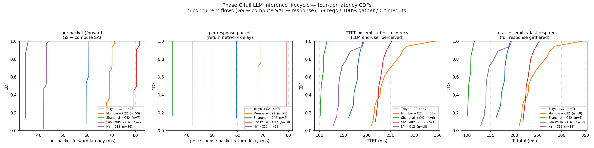
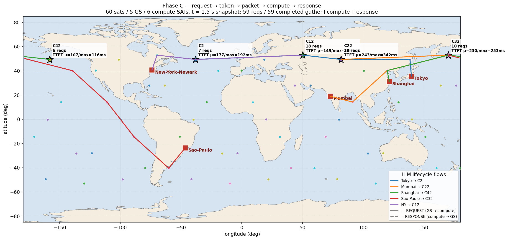
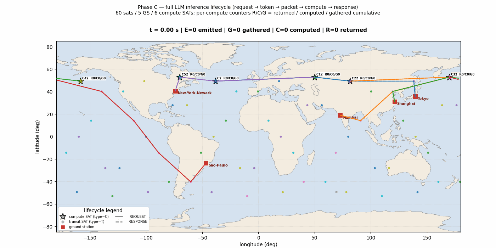

# 完整 LLM 推理生命周期场景 — request → token → packet → compute → response

Phase C 端到端测试场景。**给定混合计算/通信卫星的网络拓扑，地面站产生
LLM 推理请求；request 切 token、token 装 packet 向 compute SAT 打流，
SAT 上 GatherApplication 等齐一个 request 的全部 packet 再进 FIFO 队列
计算（α·L_in + β·L_out + γ），完成后用响应 burst 回传到 GS。我们反馈
四层端到端时延：每个 packet 的、TTFT、和整请求的。**

> 工作目录：`extensions/phase_c/scenarios/llm_full_lifecycle/`

## 一、概念与数据流

```
                     地面站 (GS)                                              compute SAT
        ┌────────────────────────────────┐                          ┌────────────────────────┐
        │ LLMRequestApplication           │                          │ GatherApplication       │
        │   1. Poisson 到达 (λ req/s)     │                          │   等齐一个 req_id 的    │
        │   2. L_in 采样 N(μ,σ) clip     │                          │   全部 total_pkts       │
        │   3. L_out 采样 (写入 tag)     │  ─── REQUEST burst ───►  │   → callback ComputeApp│
        │   4. 切成 N_pkt UDP 包         │  (LLMPacketTag dir=0)    │                          │
        │      每包带 tag (req_id ...)    │                          │ ComputeApplication      │
        │                                 │                          │   FIFO 队列             │
        │ LLMResponseSinkApplication      │                          │   T_compute =          │
        │   监听 UDP 19999, peek tag    │  ◄── RESPONSE burst ───  │     α·L_in + β·L_out + γ│
        │   写 response_log.csv          │  (LLMPacketTag dir=1)    │   到点发响应 burst     │
        └────────────────────────────────┘                          └────────────────────────┘
        ▲                                                                        │
        │                                                                        │
        └────────── 4 层时延都从 fstate 路由 + log 时间戳算出 ────────────────────┘
```

**模型层级**：
- 1 个 LLM 推理请求 = L_in 个**输入 token**（prompt 长度）
- 1 个 token = 4 字节
- 每个 UDP packet payload = 1400 B = 350 个 token
- N_pkt = ⌈L_in × 4 / 1400⌉
- 响应也按同样规则切：L_out 个**输出 token**，N_pkt_response 个响应包

**计算占位模型**：T_compute = `α · L_in + β · L_out + γ`，单 FIFO 服务（一个 compute SAT 一次只算一个 request）。

## 二、四层端到端时延

每个 packet 落到 gather_log / compute_log / response_log 三份 CSV 后，用 `req_id` join，算出 4 个时延维度：

| 层级 | 定义 | 含义 |
|---|---|---|
| **per-packet (forward)** | `recv_time_ns − t_emit_ns` 每包一样本 | 单 packet 端到端到达 compute SAT 的时延 |
| **per-token (forward)** | per-packet 值 × `tokens_in_packet` 复制 | 每个**输入 token** 抵达 compute 的时延（token 加权 CDF）|
| **per-response-packet** | `t_response_recv − t_response_emit` | 响应方向单包网络往返延迟（不含 compute 时间）|
| **TTFT** | `min(t_response_recv) − request t_emit` | **Time To First Token** — LLM 端用户真正感知的时延 |
| **T_total** | `max(t_response_recv) − request t_emit` | 整请求所有响应 token 都到齐的时延 |

T_forward / D_gather / T_queue / T_compute / T_return 五段的累计就是 TTFT。

## 三、网络拓扑（与 Phase A/B mixed_topology 复用）

| 项 | 值 |
|---|---|
| 总卫星数 | 60（6 平面 × 10，1500 km，53°） |
| **Compute SAT** | 6 颗 `C2 / C12 / C22 / C32 / C42 / C52`（每平面 in-plane idx 2）|
| **Transit SAT** | 54 颗 |
| 地面站 | 5 个：Tokyo (60) / Mumbai (61) / Shanghai (62) / Sao-Paulo (63) / NY (64) |
| ISL/GSL | 10 Mbps，100 包队列 |
| 仿真 | 4.9 s（state 覆盖到 t=4.9s），fstate 100 ms 真动态 |

State 用软链复用 `extensions/phase_a/scenarios/mixed_topology/gen_data/...`，已 augment 过全部 6 个 compute SAT 的 SAT-dst 路由（返程 SAT→GS 用 satgenpy 原生 GS-dst 路由，无需 augment）。

## 四、5 条并发流 schedule

| flow | src GS | dst compute | λ | L_in | L_out |
|---|---|---|--:|---|---|
| 0 | Tokyo (60)    | C2  (plane 0) | 4 | N(500,100) | N(200,50) |
| 1 | Mumbai (61)   | C22 (plane 2) | 6 | N(800,150) | N(300,60) |
| 2 | Shanghai (62) | C42 (plane 4) | 3 | N(300, 50) | N(150,30) |
| 3 | Sao-Paulo (63)| C32 (plane 3) | 4 | N(600,120) | N(250,50) |
| 4 | NY (64)       | C12 (plane 1) | 5 | N(500, 80) | N(200,40) |

`bytes_per_token=4`, `packet_payload=1400`，窗口 `[0.2..3.5] s`，剩余 1.4 s 仿真让响应 burst 收尾。

计算模型：`α=80 μs/输入 token`, `β=40 μs/输出 token`, `γ=8 ms`。

## 五、跑一遍

```bash
cd /home/mark/spacesim/hypatia/extensions/phase_c/scenarios/llm_full_lifecycle
bash run.sh            # ~10 秒 prereq + waf + ns-3 仿真 4.9 s
bash make_plots.sh     # ~40 秒 analyze + 3 张图（CDF + 拓扑 + 动画）
cat result.md
```

## 六、实测结果（[result.md](result.md)）

```
tx_request_count = 59     gather_complete = 59 (100%)
tx_request_packets = 128  gather_timeout = 0
rx_request_packets = 128  compute_complete = 59
                          response_recv_packets = 66
```

### 四层时延（每条流的均值，ms）

| flow | reqs | T_forward | D_gather | T_queue | T_compute | T_return | **TTFT** | T_total |
|---|--:|--:|--:|--:|--:|--:|--:|--:|
| Tokyo → C2 | 7/7 | 59.57 | 0.98 | 0.00 | 57.37 | 59.57 | **177.49** | 177.49 |
| Mumbai → C22 | 18/18 | 68.17 | 2.03 | 17.84 | 87.07 | 68.01 | **243.12** | 243.57 |
| Shanghai → C42 | 6/6 | 34.45 | 0.19 | 0.00 | 37.55 | 34.45 | **106.64** | 106.64 |
| Sao-Paulo → C32 | 10/10 | 79.37 | 1.14 | 0.00 | 79.37 | 79.37 | **230.21** | 230.21 |
| NY → C12 | 18/18 | 42.04 | 0.95 | 22.85 | 41.13 | 42.05 | **148.87** | 148.87 |

**怎么读这张表**：

- **TTFT = T_forward + D_gather + T_queue + T_compute + T_return**（恒等式，可逐行验算）
- **T_forward ≈ T_return**：同一对 GS/SAT 的路径对称（fstate 给出的最短路双向同样跳数）
- **D_gather** 是 GSL 序列化的小整数倍（1400 B / 10 Mbps = 1.144 ms × (N_pkt − 1)）
- **T_queue** 在 ρ 高的流（Mumbai λ=6 + Lᵢₙ=800 → ρ≈0.7）上是 18 ms 量级，其他流几乎没排队
- **T_compute** = 80μs × L_in + 40μs × L_out + 8 ms，跟 N(L_in, L_out) 分布吻合
- **Shanghai → C42 整链路最快**（路径短 + 不排队，TTFT 107 ms）；**Mumbai → C22 最慢**（路径长 + Lᵢₙ=800 触发排队，TTFT 243 ms）

## 七、可视化（plots/）

### plots/latency_cdf.png — 四层时延 CDF



四面板从左到右：

1. **per-packet (forward)**：单个请求包的端到端时延。Shanghai→C42 最左（34 ms），Sao-Paulo→C32 最右（79 ms）。
2. **per-response-packet**：响应方向的网络往返延迟，曲线与 (1) 几乎重合证明路径对称。
3. **TTFT**：用户感受到的"首个 token 何时回来" — 107 ms 到 243 ms 不等。
4. **T_total**：整请求所有响应 token 到齐 — 大部分与 TTFT 重合（多数请求响应只 1-2 包，差距 < 2 ms）。

### plots/topology_lifecycle.png — 拓扑 + forward/return 路径 + TTFT 标注



世界地图，t=1.5 s 时刻：

- **★ compute SAT** 粗黑边五角星 + 多行标注：`C<id>` / `<N> reqs` 当前累计完成请求数 / `TTFT μ=<mean>/max=<max>ms`
- **● transit SAT** 平面色小圆点（54 颗）
- **■ ground station** 红方块 + 城市名
- **5 条彩色路径** = 5 个 flow，每条流**正向（实线）+ 反向（虚线）双路径**叠加。Tokyo→C2 蓝，Mumbai→C22 橙，Shanghai→C42 绿，Sao-Paulo→C32 红，NY→C12 紫。
- 右下图例同时标了节点类型 + REQUEST/RESPONSE 实线/虚线意义

每颗 compute SAT 的标注让人一眼看出**哪颗服务了多少请求 + 该处 TTFT 分布**：C22（Mumbai 服务点）服务了 18 个请求 TTFT μ=243/max=342 ms 最重，C42（Shanghai 服务点）只服务了 6 个但是 TTFT μ=107 ms 最快。

### plots/topology_anim.gif — 49 帧实时动画（含 R/C/G 计数器）⭐



每 100 ms 一帧，10 fps 实时回放 ~5 秒。**最直观展示 request 在拓扑里的全生命周期流动**：

- 60 颗卫星地面投影**实时移动**（5 秒走 38 km）
- 每个 compute SAT 旁的**绿框计数器** `R<n>/C<n>/G<n>` 实时更新：
  - **R** = 已 returned 到 GS 的请求数
  - **C** = 已 computed 完成的请求数
  - **G** = 已 gathered 完整请求数
  - 这三个数 G ≥ C ≥ R 反映了流水线阶段的进度（gather → compute → return 顺序触发）
- 顶部标题逐帧更新：`t = X.XX s | E=<n> emitted | G=<n> gathered | C=<n> computed | R=<n> returned`
- 5 条流路径每帧实时追踪 fstate，**正向实线 + 反向虚线** 同步显示
- 左下图例固定：`★ compute / ● transit / ■ GS / — REQUEST / -- RESPONSE`

可以看到 0.2 s 第一个请求发出后约 90ms 第一个 G+1，再约 60ms 后 C+1，再 90ms 后 R+1。整套 lifecycle 在每个 compute SAT 上**像流水线一样推进**。

## 八、文件清单

```
scenarios/llm_full_lifecycle/
├── README.md                       ← 本文件
├── llm_workload_schedule.csv       ← 15 列 Phase C schedule (5 行)
├── config_ns3.properties           ← sim 4.9s, interval 100ms,
│                                     enable_llm_response_loop=true
├── run.sh                          ← prereq + symlink + waf
├── analyze.py                      ← 四层时延 → result.md + per-flow stage 表
├── plot_latency_cdf.py             ← 4 面板 CDF (packet/resp-packet/TTFT/total)
├── plot_topology_lifecycle.py      ← 静态地图 + forward/return 路径 + TTFT 标注
├── plot_topology_anim.py           ← 49 帧动画 + R/C/G 计数器
├── make_plots.sh                   ← 一键 analyze + 3 张图
├── result.md                       ← 实测时延报告
├── gen_data/<network> → ../../../phase_a/scenarios/mixed_topology/gen_data/<network>  (symlink)
├── run/logs_ns3/                   ← ns-3 产物
│   ├── llm_workload_summary.csv    (1 行总计)
│   ├── llm_gather_node{2,12,22,32,42}.csv    (每 compute SAT 一份 gather 日志)
│   ├── llm_compute_node{2,12,22,32,42}.csv   (compute timing)
│   ├── llm_response_node{60,61,62,63,64}.csv (每 GS 一份 response 日志)
│   └── llm_stuck_node{*}.csv        (超时 stuck request)
└── plots/
    ├── latency_cdf.png             (200 KB,  4 面板 CDF)
    ├── topology_lifecycle.png      (417 KB,  地图 + forward/return)
    └── topology_anim.gif           (3.1 MB,  49 帧实时动画)
```

## 九、给 Phase D 的接口契约

本场景把 Phase C 的所有数据契约都跑通了，Phase D（策略层）可以从这里接：

1. **可调度的资源 / SLO 是显式的**：result.md 里 TTFT μ 与 max 直接体现"哪些请求被压在队尾"——`Mumbai → C22` p95 已经到 342 ms。Phase D 可以引入**优先级队列**（短 L_in / 短 L_out 优先），在 `ComputeApplication::StartNextCompute()` 里替换 FIFO 为 min-heap。

2. **路由的对称性已经验证**：T_forward ≈ T_return 说明 fstate 双向几乎对称，Phase D 想引入"非对称路由"（去 ISL-1 走 GSL handover，回 ISL-2 走稳定路径）的话，需要从 Phase A 的 `augment_fstate.py` 那一层开始改路由生成逻辑。

3. **多 compute SAT 调度的入口**：本场景 5 个 GS → 5 个固定 compute SAT 是 1:1 静态绑定。Phase D 想做"GS → 多个候选 compute 中选一个"的话，把 `LlmWorkloadScheduler::InstallPhaseC` 里那一行 dst_node 选择改成一个 callback 即可。

4. **控制平面**：LLMPacketTag 现在 33 字节，自然对齐还有 7 字节余量。响应方向加 1 字节 `queue_depth` 让 GS 实时感知 SAT 负载是 Phase D 最便宜的反馈通道。
