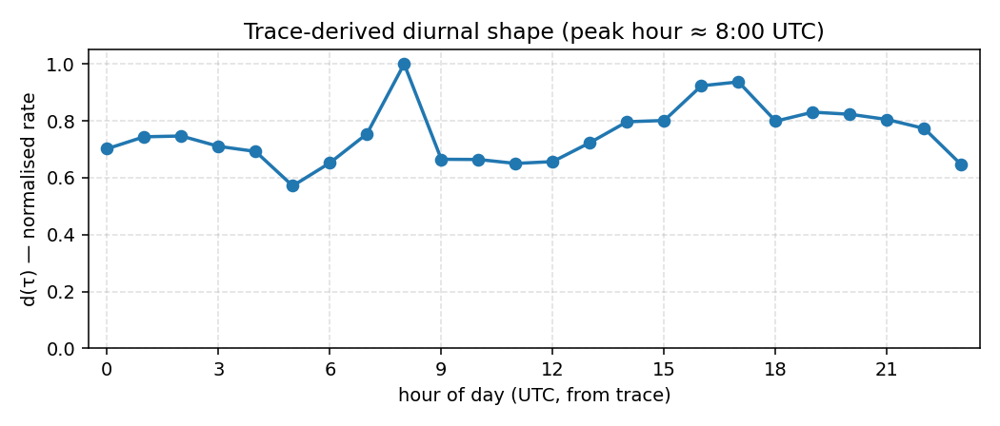
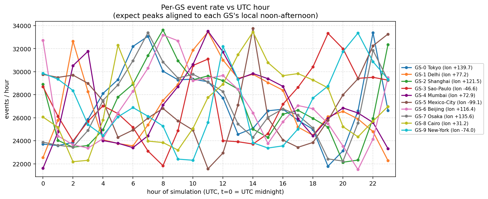

# Traffic Generator Report

## Input

- Azure trace: `azure_trace/AzureLMMInferenceTrace_multimodal.csv`
- Duration:   86400 s (24.00 h)
- Seed:       42
- GS count:   10

## Fit

| metric | value |
|---|---:|
| rows in trace | 1,000,000 |
| rows used | 999,527 |
| rows dropped (invalid) | 473 |
| time span (h) | 168.0 |
| trace TIMESTAMP min | `2024-10-15 12:00:00.269000+00:00` |
| trace TIMESTAMP max | `2024-10-22 11:59:59.964000+00:00` |
| L_in mean | 2912 |
| L_out mean | 187 |
| peak hour (UTC) | 8:00 |

### Per-bucket sample sizes

| hour | samples | d(τ) |
|---:|---:|---:|
| 00 | 38,824 | 0.702 |
| 01 | 41,157 | 0.744 |
| 02 | 41,311 | 0.747 |
| 03 | 39,308 | 0.710 |
| 04 | 38,303 | 0.692 |
| 05 | 31,610 | 0.571 |
| 06 | 36,082 | 0.652 |
| 07 | 41,748 | 0.755 |
| 08 | 55,329 | 1.000 |
| 09 | 36,785 | 0.665 |
| 10 | 36,742 | 0.664 |
| 11 | 35,975 | 0.650 |
| 12 | 36,331 | 0.657 |
| 13 | 40,018 | 0.723 |
| 14 | 44,084 | 0.797 |
| 15 | 44,328 | 0.801 |
| 16 | 51,074 | 0.923 |
| 17 | 51,832 | 0.937 |
| 18 | 44,199 | 0.799 |
| 19 | 45,947 | 0.830 |
| 20 | 45,539 | 0.823 |
| 21 | 44,524 | 0.805 |
| 22 | 42,771 | 0.773 |
| 23 | 35,706 | 0.645 |

## Per-GS expected vs actual

| GS | name | lon (deg) | λ_peak (req/s) | expected | actual | actual / expected |
|---:|---|---:|---:|---:|---:|---:|
| 0 | Tokyo | +139.69 | 10.00 | 650,345.6 | 650,560 | 1.000 |
| 1 | Delhi | +77.22 | 10.00 | 650,345.6 | 650,719 | 1.001 |
| 2 | Shanghai | +121.46 | 10.00 | 650,345.6 | 650,414 | 1.000 |
| 3 | Sao-Paulo | -46.64 | 10.00 | 650,345.6 | 650,543 | 1.000 |
| 4 | Mumbai | +72.88 | 10.00 | 650,345.6 | 651,749 | 1.002 |
| 5 | Mexico-City | -99.14 | 10.00 | 650,345.6 | 649,479 | 0.999 |
| 6 | Beijing | +116.40 | 10.00 | 650,345.6 | 649,927 | 0.999 |
| 7 | Osaka | +135.55 | 10.00 | 650,345.6 | 649,221 | 0.998 |
| 8 | Cairo | +31.24 | 10.00 | 650,345.6 | 650,941 | 1.001 |
| 9 | New-York | -74.00 | 10.00 | 650,345.6 | 651,203 | 1.001 |
| **all** | — | — | — | **6,503,456.1** | **6,504,756** | **1.000** |

Mean of d(τ) over 24h: **0.753**. The 'expected' column uses `λ_peak · duration · mean(d)`, which assumes the sim window covers a full day. For shorter / longer windows the expectation drifts by integrating d(τ) only over the covered hours.

## Sanity check

- Events: **6,504,756**
- First t_emit_ns: 11,957,295  (0.01 s)
- Last  t_emit_ns: 86,399,997,837,976  (86400.00 s)
- req_id range: 0..6504755
- monotone in t_emit_ns: **True**